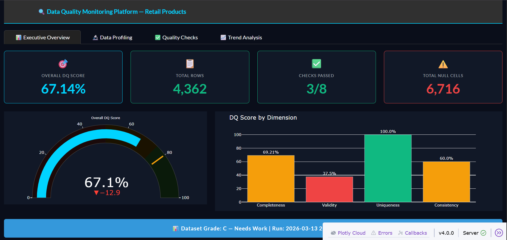
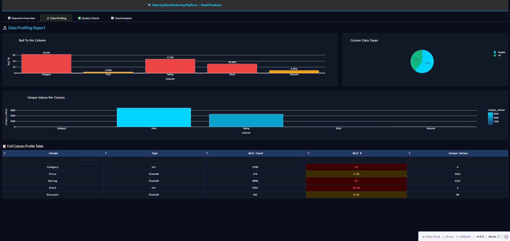
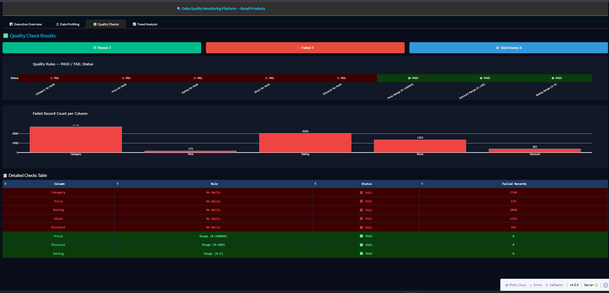
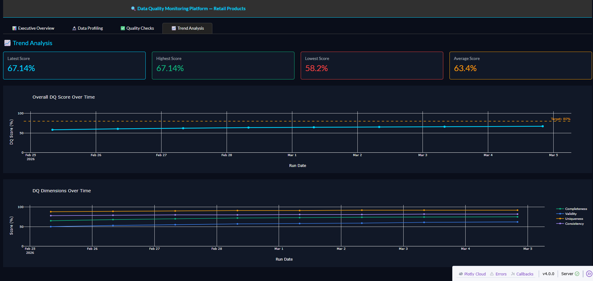

# 🔍 Enterprise Data Quality Monitoring Platform

> Automated end-to-end data quality pipeline built in Python with a live 4-page interactive Plotly Dash dashboard.


---

## 📌 Project Overview

Data is only useful when it can be trusted. This project is an automated data quality monitoring platform that profiles, validates, scores and visualizes data quality issues in a real-world Retail Product dataset.

The platform detected **6,716 missing values**, identified **5 business rule violations** out of 8 checks, and calculated an **overall DQ Score of 67.14%** — flagging the dataset as needing improvement before use in business decisions.

---

## 📊 Dashboard Screenshots

### Page 1 — Executive Overview


### Page 2 — Data Profiling


### Page 3 — Quality Checks


### Page 4 — Trend Analysis


---

## 🔑 Key Findings

| Finding | Value |
|---|---|
| Total Rows | 4,362 |
| Total Columns | 8 |
| Overall DQ Score | 67.14% |
| Total Null Cells | 6,716 |
| Checks Passed | 3 / 8 |
| Worst Column | Category — 63% null |
| Uniqueness | 100% — no duplicates |

---

## ⚙️ Tech Stack

| Tool | Purpose |
|---|---|
| Python 3.11 | Core programming language |
| pandas | Data loading and profiling |
| numpy | Numerical calculations |
| Plotly Dash | Interactive web dashboard |
| openpyxl | Automated Excel report generation |
| scikit-learn | ML anomaly detection |
| schedule | Automated daily pipeline |

---

## 🗂️ Project Structure

```
dq_monitoring_platform/
├── config/
│   ├── rules_config.json    ← Business rules
│   └── settings.json        ← Pipeline settings
├── dashboard/
│   ├── pages/
│   │   ├── overview.py      ← Page 1
│   │   ├── profiling.py     ← Page 2
│   │   ├── checks.py        ← Page 3
│   │   └── trends.py        ← Page 4
│   └── app.py               ← Main dashboard app
├── data/
│   ├── raw/                 ← Input dataset
│   └── logs/                ← Pipeline run history
├── reports/                 ← Auto Excel reports
├── scripts/
│   ├── ingestion.py         ← Load data
│   ├── profiling.py         ← Profile columns
│   ├── quality_checks.py    ← Rules engine
│   ├── scoring.py           ← DQ score calculator
│   ├── report_export.py     ← Excel generator
│   ├── anomaly_detection.py ← ML outlier detection
│   └── scheduler.py         ← Auto pipeline
├── screenshots/             ← Dashboard screenshots
├── main.py                  ← Pipeline entry point
└── requirements.txt
```

---

## 📈 DQ Score Results

| Dimension | Score |
|---|---|
| Completeness | 69.21% |
| Validity | 37.50% |
| Uniqueness | 100.0% |
| Consistency | 60.00% |
| **Overall Score** | **67.14%** |
| **Grade** | **C — Needs Work** |

---

## 🚀 How to Run

### Step 1 — Clone the repository
```bash
git clone https://github.com/sahilbhoir14/dq-monitoring-platform.git
cd dq-monitoring-platform
```

### Step 2 — Install dependencies
```bash
pip install -r requirements.txt
```

### Step 3 — Run the pipeline
```bash
python main.py
```

### Step 4 — Launch the dashboard
```bash
python dashboard/app.py
```

### Step 5 — Open in browser
```
http://127.0.0.1:8050
```

---

## 📋 Dashboard Pages

| Page | Features |
|---|---|
| Executive Overview | KPI cards, gauge chart, dimension bar chart |
| Data Profiling | Null % bar, data type pie, unique values |
| Quality Checks | PASS/FAIL heatmap, failed record counts |
| Trend Analysis | DQ score over time, 80% target line |

---

## 💡 Key Insights

1. **Category column** has 63% missing values — the biggest data quality issue in the dataset

2. **Validity score is only 37.5%** — most business rules are being violated

3. **Uniqueness is 100%** — no duplicate product records exist which is positive

4. **DQ Score improved** from 58% to 67% over 8 days of monitoring

---

## 📁 Dataset

**Retail Product Dataset with Missing Values**
- Source: Kaggle
- Rows: 4,362
- Columns: 8
- Link: https://www.kaggle.com/datasets/himelsarder/retail-product-dataset-with-missing-values

---

## 👤 Author

**Sahil Bhoir**
- GitHub: [@sahilbhoir14](https://github.com/sahilbhoir14)
- LinkedIn: [Add your LinkedIn URL here]

---

## 📄 License
This project is open source and available under the MIT License.
